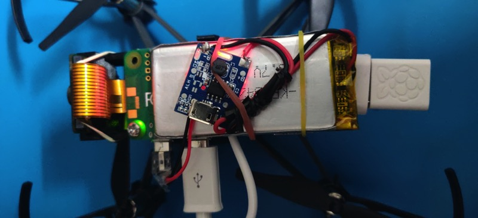
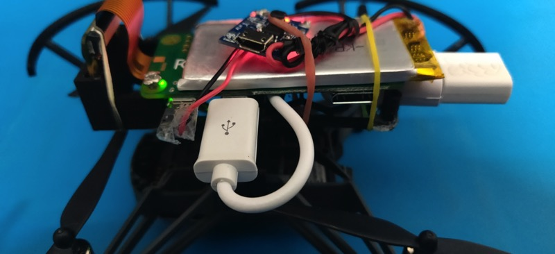

# Control DJI Tello using Raspberry Pi Zero and Xbox One S Controller

I recently bought DJI Tello and was amazed on how much you can learn and do with this little drone since it offers the ability to program. To start my learning, I decided to take inspiration from one of my pet projects on [controlling a RaspberryPi rover with Xbox One S Bluetooth Controller](https://github.com/erviveksoni/xbox-raspberrypi-rover) and extended it to control the Tello using a easy to use python library [TelloPy](https://github.com/hanyazou/TelloPy).

While working on this application, I thought it would be a really cool idea to mount the Raspberry Pi Zero on top of the Tello itself rather then using the zero as a base station and keeping it on the ground. 

Offcourse this adds additional weight to the drone (and reduce flying time) but for the application I am looking it was OK! Also, this gives me freedom of not carrying my laptop whenever I want to fly it using Xbox One S controller. Additionally this lays foundation for a few project ideas I have.

Here is a [short video](https://www.youtube.com/watch?v=rT4CF4Krcc8) of the drone in action:


But nothing stops you from flying Tello without the Raspberry mounted atop. The steps mentioned here will still be valid. Just place the Raspberry Pi on the ground.

To make this project you will need both hardware and software skills some of which I also learned during the process but that's the point... you gotta start somewhere!

Few more images of the setup.


## Prerequisites
- Raspberry Pi Zero W
- [Xbox One controller](https://www.microsoft.com/en-us/p/xbox-wireless-controller/8t2d538wc7mn?cid=msft_web_collection&activetab=pivot%3aoverviewtab) Generation 2 or later which has bluetooth support
<br/>
- [DJI Tello](https://store.dji.com/product/tello). Ensure your Tello is setup and you are able to fly with your phone app.
- [WiFi Dongle](https://www.raspberrypi.org/products/raspberry-pi-usb-wifi-dongle/)
- Micro USB to USB Type A female adapter [something like this](https://www.amazon.com/CableCreation-Adapter-Compatible-Samsung-Function/dp/B01LXBS8EJ/)
- 5V Step-Up Power Module Lithium Battery Charging Protection Board
 <br/>
- 3.7V 1200mah LiPo battery (Try getting the size: 30mm x 63mm x 4.75mm so it fits nicely over the drone)
- 3D printed [Raspberry Pi Zero Tello mount](https://www.thingiverse.com/thing:4022999) and screws
  <br/>The file RPi_zero_mount.scad zero_mount on the link above does not have a provision to hold Raspberry Pi camera. I extended this design and added a [bracket to hold camera](/files/RPi_zero_mount_with_camera.scad).
- Male micro usb cable head. You can use any old micro usb cable and cut micro usb head along with a small length of wire.
<br/>
- Wires
- Solderign gun
- Optional for this project: Raspberry Pi Camera V2

## Hardware

### Creating the LiPo Battery Module
We wont be using the USB output from the Tello to power our Raspberry Pi Zero for obvious reason :-). Lets create our own power source to power the Raspberry Pi Zero as well as a permanent setup to charge it.
 - Remove the USB Type A shell from the module carefully (You may need to use a plair). Ensure the +ve and -ve output points are visible on the chip.
 - Solder the micro usb wires -> black to the -ve and red to +ve output points.
 - Follow this [youtube link](https://www.youtube.com/watch?v=KB8S83aY35w) to solder the LiPo connector to the charging module. 
 - Check whether the inout and output are working from the above setup.

### Mounting Raspberry Pi Zero on Tello Mount
 - Assemble the 3D printed Raspberry Pi Zero Tello mount.
 - Optional: Connect the Raspberry Pi Zero Camera module to Raspberry Pi Zero
 - Mount the Raspberry Pi Zero on the 3D printed assembled mount. You can a combination of screw which fits into the mount and rubber bands (check the images).
 - Also connect the LiPo batter module and the Micro USB to USB Type A female adapter + Wifi dongle to the Raspberry Pi Zero.
<div height="200px">
<span></span>
<span></span>
</div>

### Mounting the 3D Mount on Tello
 - Detach the canopy from Tello
 - Snap the 3D Printed case on top of the Tello 


## Software

### Setting up Raspberry Pi Operating System
We will setup Raspberry Pi in headless mode to get the optimal usage of RAM and CPU. There are many good posts on how to setup Raspbian Buster Lite on the Raspberry Pi Zero in [Headless Mode](https://desertbot.io/blog/setup-pi-zero-w-headless-wifi/) 

At this point in time, we should be able to SSH into out Pi using the Wifi onboard. Also the Pi will be most likey have access to the internet (dependeing on your WIFI network settings).

### Connecting Raspberry Pi Zero to Tello
> __Note__: The steps in the section below are completely optional for this project. You can directly configure Raspberry Pi Zero to connect to Tello's WIFI network.
>The steps for doing this will be similar to the once you followed during setting up the Raspberry Pi.
>Though needless to say, your laptop should be connected to Tello's network to be able to run this application.

When you turn on Tello, it configures itself as an AP allowing the clients to connect and control to it. Once a client is connected to Tello, it looses internet connectivity. 
I wanted to avoid this blocker for a few project ideas I had in mind hence I configured the Raspberry Pi with dual WIFI interfaces. 

The Raspberry Pi Zero's onboard WIFI connects to my home network and the WIFI Adapter connects to Tello's WIFI.

- Ensure the WIFI dongle is connected to the Raspberry Pi Zero micro usb port
- Power on Raspberry Pi
- SSH into Raspberry Pi Zero
- Type `lsusb`. Ensure you see the WIFI USB adapter listed on the console output
- Type `sudo nano /etc/network/interfaces` to edit the network interfaces file
- Add the text below towards the end of the file. 
Replace the `TELLO_NETWORK_NAME` with the WIFI AP name of Tello followed by its password.

```c
auto lo

iface lo inet loopback
iface eth0 inet dhcp

allow-hotplug wlan0
iface wlan0 inet manual
wpa-roam /etc/wpa_supplicant/wpa_supplicant.conf

allow-hotplug wlan1
iface wlan1 inet dhcp
wpa-ssid "<TELLO_NETWORK_NAME>"
wpa-psk "<PASSWORD>"

iface default inet dhcp
```
- Save your changes to the interfaces file
- Shutdown Raspberry Pi Zero `sudo shutdown now`
- Turn on Tello
- Power on Raspberry Pi and SSH into it
- Type `ifconfig` to list the Raspberry Pi network interfaces
- You should see 2 interfaces `wlan0` and `wlan1` connected to their network respectively
- __In case you don't see an IP address acquired for `wlan1`__, then reset the `wlan1` interface using the command
 `sudo dhclient -v wlan1`

### Connecting Xbox One S Controller to Raspberry Pi Zero
As of today, I could only find the [xpadneo driver](https://github.com/atar-axis/xpadneo/tree/master/docs) making the Xbox One S Bluetooth controller work with Raspberry Pi. Follow the instructions on [this git repo](https://github.com/atar-axis/xpadneo/tree/master/docs) to setup the Bluetooth communication with Raspberry Pi (Raspbian).

### Installing Required Packages
SSH into Raspberry Pi and follow the steps below.
#### Installing Python

- `sudo apt-get install python3-dev`
- `sudo apt install python3-pip`

#### Installing Other Packages
- `pip3 install evdev`
- `pip3 install tellopy`

#### Setup Application Code
- Download this Repository  
  `git clone https://github.com/erviveksoni/raspberrypi-controlled-tello.git`

## Run Application
- Ensure you are connected to Tello and the Xbox Controller 
- `cd raspberrypi-controlled-tello`
- Run `Python3 flytello.py`
- Control the Tello using the Joysticks
